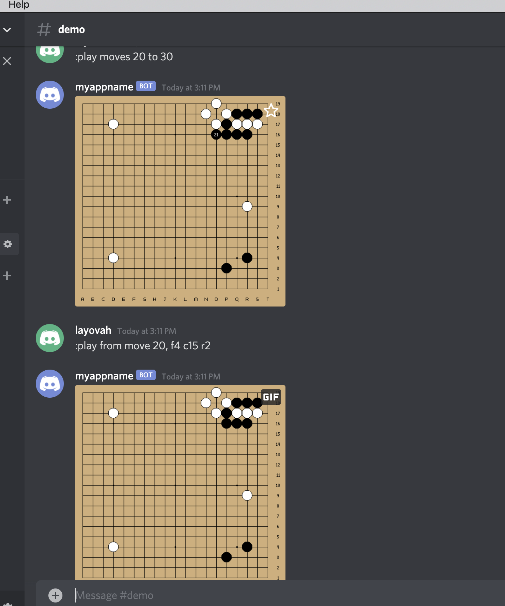

# discord-go-gif-bot

A interactive discord bot for playing out sgf games & variations as gifs

credit goes to
- https://github.com/rooklift/sgf_to_gif 
go library for converting sgf to gif.
a snapshot of the source code of this repo is kept as /sgf_to_gif in this repo.
this go lib has to be compiled and the executable placed in project root of this project, 
since this project will use that executable

- https://github.com/mattheww/sgfmill
python lib for parsing and manipulating sgf files

this project is mostly glue code around those libraries

License: MIT

